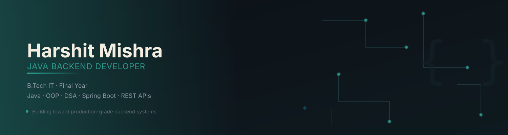

<h1 align="center">Hi, I'm Harshit Mishra 👋</h1>
<h3 align="center">Aspiring Java Backend Developer | B.Tech IT, Final Year</h3>

<p align="center">
  
</p>

<p align="center">
  <a href="mailto:YOUR_REAL_EMAIL@example.com"></a>
  <a href="https://linkedin.com/in/harshit-mishra-881640295"></a>
  <a href="https://github.com/harshitmishra22"></a>
</p>

---

### About Me

I'm a final-year Information Technology student focused on becoming a **Java Backend Developer**. I'm building a solid foundation in core Java, data structures & algorithms, and backend fundamentals, and I'm currently expanding into SQL, Spring Boot, and REST APIs. This profile tracks real, in-progress work — no filler.

### 🧠 Currently Learning


### 🛠️ Tech Stack

**Languages & Core**


**Tools**


### 🎯 Roadmap (Next Up)

- [ ] Hibernate & JPA
- [ ] Docker
- [ ] Redis
- [ ] Kafka
- [ ] Microservices architecture
- [ ] AWS
- [ ] System Design fundamentals

### 📌 Featured Projects

> _Add your actual repos here once you share them — this section is intentionally left as a template so nothing fabricated goes on your profile._

```
### [Project Name](repo-link)
One-line description of what it does and why you built it.
Tech: Java, X, Y
```

### 📊 GitHub Stats

<p align="center">
  
  
</p>

<p align="center">
  
</p>

### 📫 Contact

- Email: YOUR_REAL_EMAIL@example.com
- LinkedIn: [harshit-mishra-881640295](https://linkedin.com/in/harshit-mishra-881640295)

<p align="center"><sub>Building toward a career in Java backend development — one commit at a time.</sub></p>
